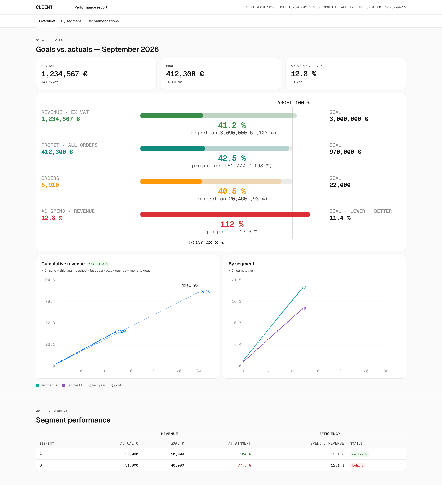

# mars-ui — design system specification

One visual language for all reports, dashboards and web apps. Visually derived from **Geist** (Vercel's design system, vercel.com/geist): neutral white/gray, Geist Sans + Geist Mono, tight headings, 1 px borders, 6/12 px radii, no shadows on surfaces, pill badges, tables with hairline dividers. mars-ui is an independent MIT project, not a Vercel product; the fonts are SIL OFL 1.1.

This document is the **spec for humans and for AI agents**: when you build an HTML report, a dashboard or a page, follow it and use `dist/ds.css` + `dist/ds.js` (or the React layer). Do not invent new colors, fonts or components.



## 1. How to use

**Static HTML report (default for client deliverables):**
```html
<link rel="stylesheet" href="ds.css">   <!-- vendored: cp node_modules/@mareksulik/mars-ui/dist/{ds.css,ds.js,fonts} . -->
<script src="ds.js"></script>             <!-- window.MarsUI: lineChart, bulletChart, table, badge, yoyChip, paceChip, formatters, token -->
```
Start from `templates/report.html` (topbar + tabs + sections + chart examples) and `templates/auth.html` (PIN gate). CDN alternative: `https://cdn.jsdelivr.net/npm/@mareksulik/mars-ui@1/dist/ds.css` (or `…/gh/mareksulik/mars-ui@1/dist/ds.css`). Vendoring is preferred for access-restricted reports.

**Next.js / React:** `npm i @mareksulik/mars-ui` → `import '@mareksulik/mars-ui/css'` in the root layout, components from `@mareksulik/mars-ui/react`. Tailwind v4: `@import '@mareksulik/mars-ui/tailwind';` in globals.css (utilities like `bg-gray-100`, `text-blue-900`, `rounded-md`, `font-mono` read the `--mu-*` tokens; dark mode via `data-theme`). Tailwind v3: `presets: [require('@mareksulik/mars-ui/tailwind/preset')]` plus `tokens.css`.

**Dark mode:** `<html data-theme="dark">`. Light is the default; never switch automatically via `prefers-color-scheme` in reports (clients read and print them).

## 2. Tokens (`--mu-*`)

| Group | Tokens | Semantics (Geist) |
|---|---|---|
| backgrounds | `--mu-background-100` (cards, topbar), `--mu-background-200` (page) | 100 = surface, 200 = canvas |
| gray | `--mu-gray-100…1000`, `--mu-gray-alpha-100…1000` | 100–300 component backgrounds (default/hover/active), 400–600 borders (`gray-alpha-400` = the standard 1 px border), 700–800 high-contrast fills and chart axes, 900 secondary text, 1000 primary text |
| accents | `blue`, `red`, `amber`, `orange`, `lime`, `green`, `teal`, `purple`, `pink` × 100–1000 | 100 badge background, 700–800 lines/bars/buttons, 900 badge text and colored numbers. `orange` and `lime` are mars-ui additions (Geist has neither), available as extra accents; status bands use Geist tokens only |
| effects | `--mu-shadow-small/medium/large/tooltip/menu/modal`, `--mu-focus-ring` | shadows only on floating elements (menus, modals); cards have none |
| radius | `--mu-radius-sm` 6 px (buttons, inputs, text badges), `--mu-radius-md` 12 px (cards, tables), `--mu-radius-lg` 16 px, `--mu-radius-full` (pills) | |
| fonts | `--mu-font-sans` Geist, `--mu-font-mono` Geist Mono | mono = numbers in tables, chart axes, meta rows, badges, code |
| spacing | `--mu-space-1…16` (4 px steps) | |

The source of truth is `tokens/tokens.json`; `python3 scripts/build.py` generates CSS, JS and Tailwind. Never edit values in `dist/`.

## 3. Typography

Scale classes (`dist/typography.css`): `.heading-72 … .heading-14` (weight 600, tracking −0.04 to −0.01 em), `.copy-16/14/13` (400), `.label-14/13/12` (500), `.button-14/12`. Add `.mono` for Geist Mono. Base elements: `h1` 32/40, `h2` 28/36, `h3` 22/30, `body` 15/1.5.

Rules: headings are always Geist Sans, never serif. Numbers compared in a column go mono. Chart subtitles (`.fig-sub`) are 13 px gray-900. Sections carry a mono uppercase number (`.sec-num`, "01 — OVERVIEW") and an `h2`.

## 4. Components (CSS classes are the API)

- **Topbar** `header.topbar > .wrap > .brand (logo svg | .slash | .app) + .meta-row` — inline SVG logo with `fill="currentColor"`, 22 px tall.
- **Tabs** `nav > .wrap > a(.active)` — 14 px, active tab has a 2 px black underline, sticky.
- **Card / figure** `.card` or `<figure><figcaption>…<div class="fig-sub">…` — white, 1 px `gray-alpha-400`, radius 12, padding 20.
- **Stat** `.stat > .label + .value (+ .delta.pos/.neg)` — mono 28 px value.
- **Table** `.tbl-scroll > table(.grouped)` — `th` mono uppercase 13 px on `background-200`, `td.num` mono right-aligned, `tr.grp th` group header row (e.g. REVENUE / PROFIT / SPEND), `.gs` left divider on the first column of a group, `tr.hl` highlighted row, `.pos/.neg` green/red text 500. Prefer triplets (actual · target · attainment) over flat 15-column tables.
- **Badge** `.chip.chip-{ok|warn|crit|info|neutral|purple|teal|pink|brand|inverted}` — mono 12 px pill, background 100 / text 900. ok = met, warn = attention, crit = problem, info = running/active, neutral = plan/inactive.
- **Button** `.btn.btn-{primary|secondary|tertiary|error|brand}(.btn-sm|.btn-lg|.btn-block)` — primary is black, 40 px, radius 6.
- **Input** `.input(.input-mono)`, `.field > label + .input + .hint/.error`.
- **Legend** `.legend > span > .sw` (+ `.sw-dashed` last year, `.sw-dotted` path to goal, `.sw-goal` goal).
- **Note** `.note(.note-warn|.note-error|.note-ok)`.
- **Footer** `footer.site` — copyright left, note right, 13 px gray-900.
- **Tabs, right-aligned item** `nav a.right` (e.g. a "Legend" link).
- **Methodology page** (legend / definitions for clients): `dl.spec` (mono term · description), `.formula` (mono block), `.cell` (spreadsheet cell reference pill, e.g. AG5), `.src` (API field name), `figure.shot > img + .cap` (annotated screenshot with caption), `.metric` (definition card), `.band` (color swatch).

## 5. Charts (`dist/ds.js` → `MarsUI`)

- `lineChart(el, labels, series, opts)` — series `{label,color,values,dash,opacity,width,nodots}`; `opts.goal` draws a black dashed goal line, `opts.yfmt/tfmt` formatters, `opts.xstep`, `opts.wide`. The left margin adapts to the widest axis label.
- Conventions: **this year solid**, **last year same color dashed `5 4` at opacity .55** (.35 in multi-entity comparisons), **monthly goal black dashed**, **linear path to goal gray dotted `2 4`** (gray-600, width 1). Company-wide series = `blue-700`. Grid `gray-200`, axes `gray-700`.
- `bulletChart(el, rows, {progress})` — each row: label + value on the left, bar to goal (100 % = vertical black line), big percentage and projection in the middle, target on the right; `progress` draws "TODAY x %".
- **Status bands — fixed rule** (`ratioColor`, `status`). A small miss stays cool (teal); from 3 % on it turns warm:

  | deviation from goal (worse direction) | token | color |
  |---|---|---|
  | met (≤ 0 %) | `green-800` | green |
  | within 3 % | `teal-800` | teal |
  | within 10 % | `amber-800` | amber |
  | beyond 10 % | `red-800` | red |
  | no data | `gray-700` | gray |

  Do not change the bands or the colors without an explicit decision. Never use `amber-900` on bars or big numbers — it is brown; `amber` is only for `chip-warn` / `note-warn` badges and as a series color.
- Series palette for several entities: amber-800, teal-700, purple-700, red-700, blue-700, pink-700 (text = step 900; for amber use `orange-900` as text, not the brown `amber-900`).

## 6. Brand layer

Clients never change neutrals or status colors. They supply a logo (inline SVG, `currentColor`) and optionally `--brand-primary` (+ `-text`, `-bg`) in the project's `:root`. Utilities: `.btn-brand`, `.chip-brand`, `.brand-accent`, `.bg-brand`.

## 7. Don'ts

Serif fonts, shadows on cards, radii other than 6/12/16, hex values outside the tokens, colored section backgrounds, more than two accents on one screen (chart series excepted), Vercel icons (use Lucide, ISC), text or images from Vercel's documentation, the name "Geist" for this system.

## 8. Development

`python3 scripts/build.py` (tokens → dist + Tailwind + contrast check), `npm run build:react` (tsc → dist/react), `npm run check`. Semantic versioning, `CHANGELOG.md`. Publishing: `npm publish --access public`; tag `vX.Y.Z` → jsDelivr `…/gh/mareksulik/mars-ui@X/dist/ds.css`.
