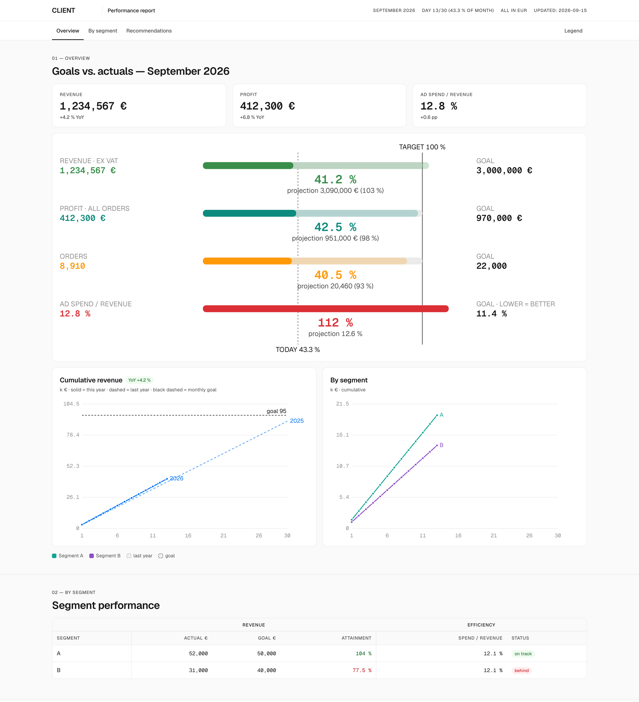

# mars-ui — design system specification

One visual language for all reports, dashboards and web apps. Visually derived from **Geist** (Vercel's design system, vercel.com/geist): neutral white/gray, Geist Sans + Geist Mono, tight headings, 1 px borders, 6/12 px radii, no shadows on surfaces, pill badges, tables with hairline dividers. mars-ui is an independent MIT project, not a Vercel product; the fonts are SIL OFL 1.1.

This document is the **spec for humans and for AI agents**: when you build an HTML report, a dashboard or a page, follow it and use `dist/ds.css` + `dist/ds.js` (or the React layer). Do not invent new colors, fonts or components.



## 1. How to use

**Static HTML report (default for client deliverables):**
```html
<link rel="stylesheet" href="ds.css">   <!-- vendored: cp node_modules/@mareksulik/mars-ui/dist/{ds.css,ds.js,fonts} . -->
<script src="ds.js"></script>             <!-- window.MarsUI: lineChart, bulletChart, table, badge, yoyChip, paceChip, formatters, token -->
```
Start from `templates/report.html` (topbar + tabs + sections + chart examples) and `templates/auth.html` (PIN gate). CDN alternative: `https://cdn.jsdelivr.net/npm/@mareksulik/mars-ui@1/dist/ds.css` (or `…/gh/mareksulik/mars-ui@1/dist/ds.css`). Vendoring is preferred for access-restricted reports.

**Next.js / React:** `npm i @mareksulik/mars-ui` → `import '@mareksulik/mars-ui/css'` in the root layout, components from `@mareksulik/mars-ui/react`. Tailwind v4: `@import '@mareksulik/mars-ui/tailwind';` in globals.css (utilities like `bg-gray-100`, `text-blue-900`, `rounded-md`, `font-mono` read the `--mu-*` tokens; dark mode via `data-theme`). Tailwind v3: `presets: [require('@mareksulik/mars-ui/tailwind/preset')]` plus `tokens.css`.

**Dark mode:** `<html data-theme="dark">`. Light is the default; never switch automatically via `prefers-color-scheme` in reports (clients read and print them).

## 2. Tokens (`--mu-*`)

| Group | Tokens | Semantics (Geist) |
|---|---|---|
| backgrounds | `--mu-background-100` (cards, topbar), `--mu-background-200` (page) | 100 = surface, 200 = canvas |
| gray | `--mu-gray-100…1000`, `--mu-gray-alpha-100…1000` | 100–300 component backgrounds (default/hover/active), 400–600 borders (`gray-alpha-400` = the standard 1 px border), 700–800 high-contrast fills and chart axes, 900 secondary text, 1000 primary text |
| accents | `blue`, `red`, `amber`, `orange`, `lime`, `green`, `teal`, `purple`, `pink` × 100–1000 | 100 badge background, 700–800 lines/bars/buttons, 900 badge text and colored numbers. `orange` and `lime` are mars-ui additions (Geist has neither), available as extra accents; status bands use Geist tokens only |
| effects | `--mu-shadow-small/medium/large/tooltip/menu/modal`, `--mu-focus-ring` | shadows only on floating elements (menus, modals); cards have none |
| radius | `--mu-radius-sm` 6 px (buttons, inputs, text badges), `--mu-radius-md` 12 px (cards, tables), `--mu-radius-lg` 16 px, `--mu-radius-full` (pills) | |
| fonts | `--mu-font-sans` Geist, `--mu-font-mono` Geist Mono | sans = all language, mono = values and code only, serif = never (§3) |
| spacing | `--mu-space-1…16` (4 px steps) | |

The source of truth is `tokens/tokens.json`; `python3 scripts/build.py` generates CSS, JS and Tailwind. Never edit values in `dist/`.

## 3. Typography — fixed roles

Every piece of text has exactly one role. The role decides font, size, weight and case; nothing else does. If text does not fit a role, it is the wrong text, not a reason for a new size.

**Which font**

| Font | Use for | Never for |
|---|---|---|
| **Geist Sans** | everything that is language: headings, body, list items, table headers, labels, eyebrows, badges, buttons, tabs, captions, chart series names and annotations | — |
| **Geist Mono** | **values** the reader compares or copies: numbers in table cells (`td.num`), KPI values (`.stat .value`), chart axis ticks and value labels (`svg text.v`); **code and identifiers**: `code`, `.formula`, `.cell`, `.src`, API fields, file paths, IDs | words and sentences, labels, headers, badges, list numbers, section numbers, captions under images |
| **Serif** | nothing | everything — mars-ui has no serif |

Test for mono: *would the reader line it up with other values or paste it somewhere?* Yes → mono. Otherwise sans. Ordinals and indexes (`01 — Zhrnutie`, list markers, step numbers) are structure, not values → sans with `tabular-nums`.

**The roles (the only sizes in the system)**

| Role | Font · size / line · weight | Elements |
|---|---|---|
| Page title | sans 32/40 · 600 · −0.02em | `h1` |
| Section title | sans 28/36 · 600 · −0.02em | `h2` |
| Subsection | sans 22/30 · 600 · −0.02em | `h3` |
| Card title | sans 18/26 · 600 · −0.01em | `figcaption`, `.card-title` |
| Minor heading | sans 16/24 · 600 · −0.01em | `h4` |
| Body | sans 15/24 · 400 | `p`, `li`, `td`, `dd`, `.note`, `.text-body` |
| Small | sans 13/18 · 400 | `.fig-sub`, `.legend`, `.stat .delta`, `.shot .cap`, `.hint`, footer, `.text-small`, chart series names and annotations |
| Label | sans 12/16 · 500 · uppercase · 0.06em | `.sec-num`, `th`, `.stat .label`, `.meta-row`, `dl.spec dt`, `.text-label` |
| Control | sans 14/20 · 500 (13 small, 16 large) | tabs, `.btn`, `.input`, `.field label`, topbar app name |
| Badge | sans 12/20 · 500 · pill | `.chip` (`.chip-mono` only for a code inside) |
| Value | mono 14 in tables, 28/36 · 600 KPI, 22 · 600 bullet chart percent, 16 · 600 bullet chart values, 12 axis ticks | `td.num`, `.stat .value`, `svg text.v`, `.num` |
| Code | mono 14/20 block, 0.93 em inline | `pre`, `.formula`, `code`, `.cell`, `.src`, `kbd` |

Rules:
- Allowed sizes are 12, 13, 14, 15, 16, 18, 22, 28, 32 px (plus `.heading-40…72` for landing pages only). No half pixels, no 10 or 11 px text.
- Inline mono inside sans text is one step smaller (`0.93em`: 15 → 14, 13 → 12) so it does not look bolder than its sentence.
- Hierarchy comes from role, not from bold: inside running text only `strong` (600) for a lead-in phrase; never bold a whole paragraph.
- All numbers use `tabular-nums`; columns of numbers are right-aligned (`.num`).
- `.text-body`, `.text-small`, `.text-label`, `.num` apply a role to any element. The scale classes `.heading-*`, `.copy-*`, `.label-*`, `.button-*` (`dist/typography.css`) stay for compatibility; `.mono` on them is allowed only for values.

**Lists**

- `ul` / `ol` are indented 24 px with 4 px between marker and text, so markers stay inside cards. Items are 8 px apart (4 px inside `.text-small`), nested lists start 8 px below their parent item.
- Bullet markers `gray-700`, numbers `gray-900` · 500 · tabular, both in sans. List text is Body (or Small inside `.text-small`).
- A lead-in phrase in an item is `strong` followed by the sentence: `<li><strong>Žiadne video.</strong> Všetkých 12…</li>`.
- `ul.plain` / `ol.plain` remove markers and indent (for lists that are really stacks of cards or links).
- The last child of a `.card`, `figure` or `.note` has no bottom margin.

## 4. Components (CSS classes are the API)

- **Topbar** `header.topbar > .wrap > .brand (logo svg | .slash | .app) + .meta-row` — inline SVG logo with `fill="currentColor"`, 22 px tall.
- **Tabs** `nav > .wrap > a(.active)` — 14 px, active tab has a 2 px black underline, sticky.
- **Card / figure** `.card` or `<figure><figcaption>…<div class="fig-sub">…` — white, 1 px `gray-alpha-400`, radius 12, padding 20. Title = Card title role, `.fig-sub` = Small.
- **Stat** `.stat > .label + .value (+ .delta.pos/.neg)` — sans Label, mono 28 px value, Small delta.
- **Table** `.tbl-scroll > table(.grouped)` — `th` sans Label on `background-200`, text cells sans Body, `td.num` mono 14 right-aligned, `tr.grp th` group header row (e.g. REVENUE / PROFIT / SPEND), `.gs` left divider on the first column of a group, `tr.hl` highlighted row, `.pos/.neg` green/red text 500. Prefer triplets (actual · target · attainment) over flat 15-column tables.
- **Badge** `.chip.chip-{ok|warn|crit|info|neutral|purple|teal|pink|brand|inverted}` — sans 12 px pill (`.chip-mono` only for a code), background 100 / text 900. ok = met, warn = attention, crit = problem, info = running/active, neutral = plan/inactive.
- **Button** `.btn.btn-{primary|secondary|tertiary|error|brand}(.btn-sm|.btn-lg|.btn-block)` — primary is black, 40 px, radius 6.
- **Input** `.input(.input-mono)`, `.field > label + .input + .hint/.error`.
- **Legend** `.legend > span > .sw` (+ `.sw-dashed` last year, `.sw-dotted` path to goal, `.sw-goal` goal).
- **Note** `.note(.note-warn|.note-error|.note-ok)`.
- **Footer** `footer.site` — copyright left, note right, 13 px gray-900.
- **Tabs, right-aligned item** `nav a.right` (e.g. a "Legend" link).
- **Methodology page** (legend / definitions for clients): `dl.spec` (sans Label term · Body description), `.formula` (mono block), `.cell` (spreadsheet cell reference pill, e.g. AG5), `.src` (API field name), `figure.shot > img + .cap` (annotated screenshot with caption), `.metric` (definition card), `.band` (color swatch).

## 5. Charts (`dist/ds.js` → `MarsUI`)

- `lineChart(el, labels, series, opts)` — series `{label,color,values,dash,opacity,width,nodots}`; `opts.goal` draws a black dashed goal line, `opts.yfmt/tfmt` formatters, `opts.xstep`, `opts.wide`. The left margin adapts to the widest axis label.
- Conventions: **this year solid**, **last year same color dashed `5 4` at opacity .55** (.35 in multi-entity comparisons), **monthly goal black dashed**, **linear path to goal gray dotted `2 4`** (gray-600, width 1). Company-wide series = `blue-700`. Grid `gray-200`, axes `gray-700`.
- `bulletChart(el, rows, {progress})` — each row: label + value on the left, bar to goal (100 % = vertical black line), big percentage and projection in the middle, target on the right; `progress` draws "TODAY x %".
- **Status bands — fixed rule** (`ratioColor`, `status`). A small miss stays cool (teal); from 3 % on it turns warm:

  | deviation from goal (worse direction) | token | color |
  |---|---|---|
  | met (≤ 0 %) | `green-800` | green |
  | within 3 % | `teal-800` | teal |
  | within 10 % | `amber-800` | amber |
  | beyond 10 % | `red-800` | red |
  | no data | `gray-700` | gray |

  Do not change the bands or the colors without an explicit decision. Never use `amber-900` on bars or big numbers — it is brown; `amber` is only for `chip-warn` / `note-warn` badges and as a series color.
- Series palette for several entities: amber-800, teal-700, purple-700, red-700, blue-700, pink-700 (text = step 900; for amber use `orange-900` as text, not the brown `amber-900`).

## 6. Brand layer

Clients never change neutrals or status colors. They supply a logo (inline SVG, `currentColor`) and optionally `--brand-primary` (+ `-text`, `-bg`) in the project's `:root`. Utilities: `.btn-brand`, `.chip-brand`, `.brand-accent`, `.bg-brand`.

## 7. Don'ts

Serif fonts, shadows on cards, radii other than 6/12/16, hex values outside the tokens, colored section backgrounds, more than two accents on one screen (chart series excepted), Vercel icons (use Lucide, ISC), text or images from Vercel's documentation, the name "Geist" for this system.

## 8. Development

`python3 scripts/build.py` (tokens → dist + Tailwind + contrast check), `npm run build:react` (tsc → dist/react), `npm run check`. Semantic versioning, `CHANGELOG.md`. Publishing: `npm publish --access public`; tag `vX.Y.Z` → jsDelivr `…/gh/mareksulik/mars-ui@X/dist/ds.css`.
