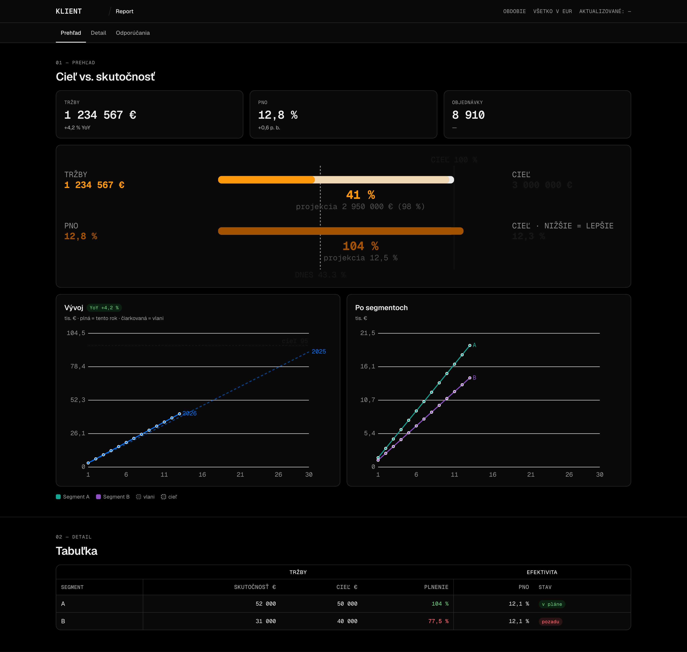

# mars-ui

A small, dependency-free design system for reports, dashboards and web apps: design tokens (light + dark), CSS components, vanilla SVG charts, a Tailwind (v3/v4) layer and thin React components.

Visually derived from [Geist](https://vercel.com/geist), Vercel's design system. Ships the Geist Sans and Geist Mono fonts (SIL Open Font License 1.1). mars-ui is an independent project and is not affiliated with or endorsed by Vercel.


<details><summary>Dark mode (<code>&lt;html data-theme="dark"&gt;</code>)</summary>



</details>

## What's inside

| Path | Contents |
|---|---|
| `tokens/tokens.json` | Single source of truth: 8 color scales × 100–1000 (light + dark), gray-alpha, backgrounds, shadows, focus, radii, spacing, type scale, fonts |
| `dist/ds.css` | Everything a static page needs: tokens, typography classes, base styles, components (topbar, tabs, card, stat, table with grouped headers, badge, button, input, legend, note), brand layer |
| `dist/ds.js` / `ds.esm.js` | `MarsUI`: `lineChart`, `bulletChart`, `table`, `badge`, `yoyChip`, `paceChip`, `ratioColor`, `formatters`, `token` |
| `dist/tokens.css`, `dist/tokens.js` | Tokens only (`--mu-*` custom properties / ESM object) |
| `dist/fonts/` | Geist Sans + Geist Mono variable woff2 + OFL license |
| `dist/react/` | React components (`Badge`, `Button`, `Input`, `Field`, `Card`, `Stat`, `SectionHeader`, `Topbar`, `Tabs`, `Table`, `Td`, `Legend`, `Note`, `setTheme`) with types |
| `tailwind/theme.css`, `tailwind/preset.cjs` | Tailwind v4 `@theme inline` and v3 preset mapping utilities to the tokens |
| `templates/` | `report.html` (topbar, tabs, sections, charts, table) and `auth.html` (PIN gate) |
| `DESIGN_SYSTEM.md` | The specification: semantics, rules, component API. Written for humans and AI agents |

## Usage

### Static HTML (reports, dashboards)

Copy `dist/ds.css`, `dist/ds.js` and `dist/fonts/` next to your HTML (see `templates/report.html`):

```html
<link rel="stylesheet" href="ds.css">
<script src="ds.js"></script>
<script>
  const UI = window.MarsUI, F = UI.formatters('en-US');
  UI.lineChart(document.getElementById('chart'), labels, [
    { label: '2025', color: UI.token('blue-700'), values: lastYear, dash: '5 4', opacity: .55, nodots: true },
    { label: '2026', color: UI.token('blue-700'), values: thisYear },
  ], { goal: 95000, yfmt: F.k, tfmt: F.eur, xstep: 5 });
</script>
```

CDN (jsDelivr, straight from GitHub tags):

```html
<link rel="stylesheet" href="https://cdn.jsdelivr.net/gh/mareksulik/mars-ui@1/dist/ds.css">
<script src="https://cdn.jsdelivr.net/gh/mareksulik/mars-ui@1/dist/ds.js"></script>
```

Vendoring is recommended for access-restricted reports so the page has no external dependency.

### React / Next.js

```bash
npm i @mareksulik/mars-ui      # or: npm i github:mareksulik/mars-ui
```

```tsx
import '@mareksulik/mars-ui/css';
import { Topbar, Tabs, Card, Table, Td, Badge } from '@mareksulik/mars-ui/react';
```

### Tailwind

- **v4** — in your global CSS: `@import '@mareksulik/mars-ui/tailwind';` Utilities such as `bg-gray-100`, `text-blue-900`, `rounded-md`, `font-mono`, `shadow-small` resolve to `--mu-*` variables, so dark mode works through `data-theme`.
- **v3** — `presets: [require('@mareksulik/mars-ui/tailwind/preset')]` and import `dist/tokens.css`.

### Dark mode

`<html data-theme="dark">`. Light is the default; the system never switches automatically.

### Branding

Neutrals and status colors never change per client. A client supplies a logo (inline SVG with `fill="currentColor"`) and optionally `--brand-primary` / `--brand-primary-text` / `--brand-primary-bg` in `:root`. See `src/brand.css`.

## Development

```bash
python3 scripts/build.py   # tokens.json → dist/ + tailwind/, runs a WCAG AA contrast check
npm run build:react        # src/react → dist/react (tsc)
npm run check              # strict build + type check
```

Edit `tokens/tokens.json` or `src/*`, never `dist/`. Semantic versioning; tags (`vX.Y.Z`) feed jsDelivr.

## License

Code: MIT. Fonts: SIL Open Font License 1.1 (`dist/fonts/LICENSE-OFL.txt`). "Vercel" and "Geist" are trademarks of Vercel, Inc.; no Vercel code, icons or documentation is included.
